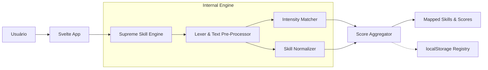

# 🎓✨ UniQuest


> **Um motor avançado de extração e análise de habilidades para vagas de emprego.**

**UniQuest** é uma aplicação web desenvolvida em **Svelte** e em **TypeScript**, projetada para extrair, categorizar e pontuar requisitos técnicos e comportamentais a partir de descrições de vagas usando processamento de linguagem natural focado.

A plataforma oferece um mecanismo poderoso (Target Skill Engine) para limpar ruídos das postagens de emprego, entender a prioridade dos requisitos (Obrigatório, Desejável, etc.) e formar um registro de habilidades consolidado, independente do jargão ou formato informal dos recrutadores.

## 🌌 Funcionalidades Principais

| Feature | Tecnologia / Implementação | Descrição |
| :--- | :--- | :--- |
| **Supreme Skill Engine** | `src/lib/SupremeSkillEngine.ts` | Motor de parsing avançado para examinar vagas, pontuando os requisitos com base no contexto semântico. |
| **Intensity Detection** | `SupremeSkillEngine.ts` | Avaliação da força da skill (Mandatório, Diferencial, Básico) mapeada a uma pontuação fixa. |
| **Noise Reduction** | `LexerParser.js` | Filtros robustos para remover preposições, jargões contratuais (benefícios, modelo de contratação) e verbos de ação que não representam habilidades. |
| **Acronym Normalization** | `SupremeSkillEngine.ts` | Reconhecimento e padronização automática de dezenas de acrônimos comuns do mercado e tecnologias de TI. |
| **Skill Registry** | `skill_registry.json` | Dicionário adaptável persistido que mapeia novas habilidades identificadas e as classifica por área (TI, Artes, Psicologia). |

## 🎴 Arquitetura do Sistema



## 🌺 Como Executar

### Desenvolvimento Local

#### Requisitos

* **Node.js** v18+
* **npm** (ou Yarn/PNPM)

#### Instalação

```bash
# Clone e entre na pasta da aplicação web
git clone https://github.com/EduLoboM/UniQuest.git
cd UniQuest/webapp

# Instalar dependências do ecossistema Svelte/Vite
npm install

# Executar servidor de desenvolvimento com hot-reload (HMR)
npm run dev

# Acesse a aplicação na porta indicada pelo Vite (geralmente localhost:5173)
```

## 💮 Estrutura do Projeto

```
UniQuest/
├── package.json                  # Informações raíz
├── README.md                     # Documentação (você está aqui)
└── webapp/
    ├── src/
    │   └── lib/
    │       └── SupremeSkillEngine.ts # Implementação TypeScript central da engine
    ├── vite.config.js            # Configuração do Vite
    ├── svelte.config.js          # Configuração do framework Svelte
    ├── package.json              # Dependências de frontend
    ├── LexerParser.js            # Motor CLI e implementação em JS
    ├── vaga_ti.txt               # Input base de exemplo para T.I.
    ├── vaga_artes.txt            # Input base de exemplo para Artes
    ├── vaga_psicologia.txt       # Input base de exemplo para Psicologia
    ├── skill_registry.json       # Base de dados estruturada das habilidades
    └── skill_courses.json        # Mapeamento do currículo de cursos
```

## 🏵️ Testes

A base principal da lógica (o processador de linguagem natural) conta com scripts dedicados e ferramentas de processamento pontual via Node.js para validação do comportamento antes do envio para o frontend.

### Testar Engine via CLI Local

```bash
# Entrar no diretório web
cd webapp

# Avaliar o motor interpretando diferentes arquivos TXT (Vagas mock)
node LexerParser.js
```
*O script em JS varre as vagas de Artes, TI e Psicologia detalhando a captura das skills via console log.*

## 🎋 CI/CD

Com um frontend agnóstico, pipelines podem ser escalados no GitHub Actions como o seguinte fluxo genérico:

1. **Checkout** - Captura do código fonte e assets
2. **Setup Node** - Instalação da cadeia NPM compatível
3. **Dependencies** - Obtenção transparente dos módulos do Svelte
4. **Build** - `npm run build` na geração de estáticos do Vite

## 💠 Destaques Técnicos

### Tratamento Flexível de Requisitos

A varredura ignora com sucesso sentenças descritivas densas para destacar o conteúdo vital:
- **Separações Complexas**: Quebra habilidades emendadas por conjunções de diferentes cenários (`"e/ou"`, `"e"`, `"/"`, `","`).
- **Verbos de Ação Capped**: Remove termos de introdução típicos do HR (ex: `"Experiência em atuar com React"` torna-se `"React"`).

### Persistence System

A plataforma implementa um formato em que o estado reativo salva incrementalmente as novas tags detectadas. A base da categoria atualiza ativamente baseando-se no cruzamento diário de milhares de requerimentos de jobs diferentes, alimentando a infraestrutura que mapeia a educação desejada.

---

<p align="center">
Desenvolvido com ✨ por <b>Eduardo Lôbo Moreira</b>.
</p>